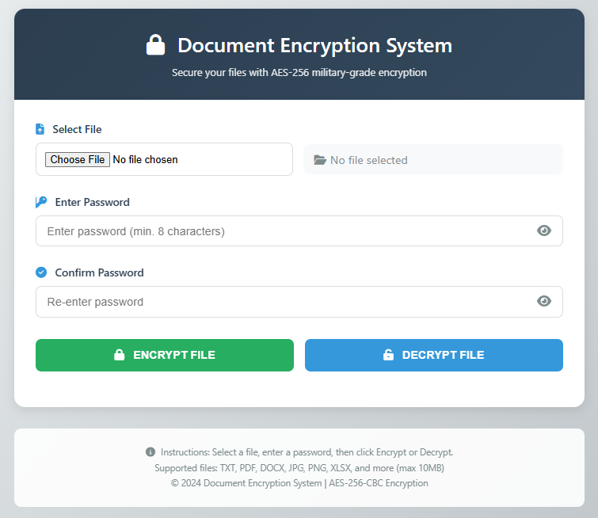
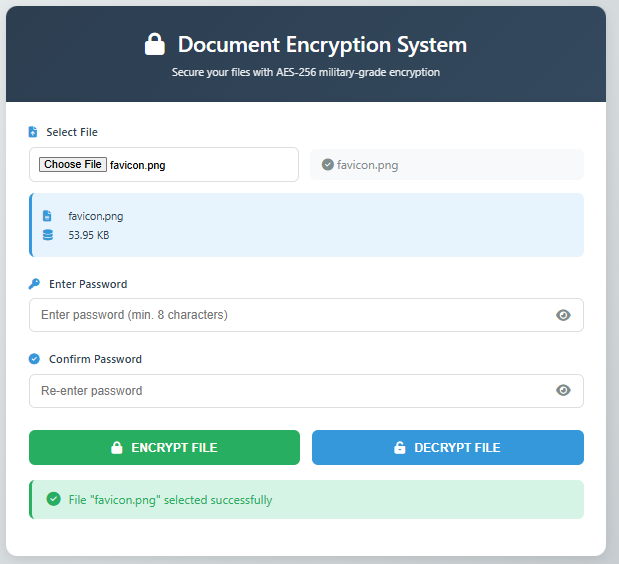
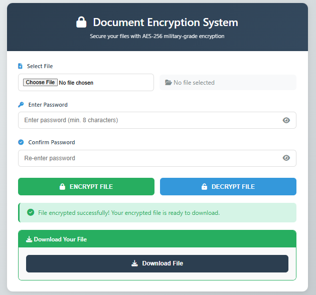
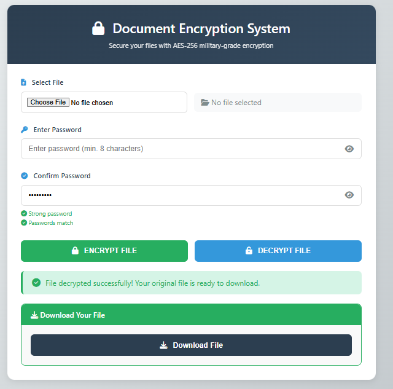

# DOCUMENT ENCRYPTION SYSTEM

A web-based file encryption and decryption system that allows users to securely encrypt and decrypt files using **AES-256-CBC encryption** and password-based key derivation.

---

## PROJECT INFORMATION

**Project Name:** Document Encryption System  
**Developer:** SUNDAY GOODMAN AKPAN  
**Project Type:** ND Computer Science Project  
**Version:** 1.0  
**Technology:** PHP, HTML, CSS, JavaScript  
**Encryption:** AES-256-CBC  
**Key Derivation:** PBKDF2-HMAC-SHA256  
**Database:** Not Required

---

## PROJECT DESCRIPTION

The Document Encryption System is a web-based application developed to allow users to encrypt and decrypt files using a password.

The system uses the PHP OpenSSL extension and AES-256-CBC encryption to protect files from unauthorized access.

Users can select a file, provide a password, encrypt the file, and download the resulting `.enc` file. The encrypted file can later be uploaded and decrypted using the correct password.

The application does not require a database and is designed as a self-contained PHP web application.

---

## KEY FEATURES

- AES-256-CBC file encryption
- Password-based file decryption
- PBKDF2-HMAC-SHA256 key derivation
- Random salt generation
- Random initialization vector (IV)
- Support for multiple file types
- Maximum file size of 10MB
- Password confirmation during encryption
- Password strength indication
- Automatic cleanup of temporary files
- No database required
- Responsive web interface
- Download encrypted files
- Download decrypted files
- Passwords are not stored
- Server-side file processing
- Input validation and error handling

---

## SUPPORTED FILE TYPES

The system can process different file types, including:

- TXT
- PDF
- DOC
- DOCX
- XLS
- XLSX
- JPG
- JPEG
- PNG
- ZIP
- CSV
- And other file formats

**Maximum file size:** 10MB.

The exact file types accepted may depend on the application's server-side validation configuration.

---

## TECHNOLOGIES USED

### Frontend

- HTML5
- CSS3
- JavaScript
- Font Awesome

### Backend

- PHP 7.4+

### Encryption

- OpenSSL
- AES-256-CBC
- PBKDF2-HMAC-SHA256

### Web Server

- Apache
- XAMPP / WAMP recommended for local development

---

# SYSTEM REQUIREMENTS

The following are required to run the application:

- PHP 7.4 or higher
- OpenSSL PHP extension enabled
- Apache web server
- XAMPP or WAMP recommended for local installation
- At least 100MB of available disk space
- Modern web browser

Recommended browsers:

- Google Chrome
- Mozilla Firefox
- Microsoft Edge
- Safari

---

# INSTALLATION GUIDE

## 1. Download or Clone the Project

Place the project inside your web server's document directory.

### XAMPP

```text
C:\xampp\htdocs\encryption_system
```

### WAMP

```text
C:\wamp\www\encryption_system
```

### Linux Apache

```text
/var/www/html/encryption_system/
```

---

## 2. Start Apache

If you are using XAMPP:

1. Open XAMPP Control Panel.
2. Start **Apache**.
3. Make sure Apache is running successfully.

The current version does not require MySQL or any other database.

---

## 3. Check Required Directories

Make sure the following directories exist:

```text
uploads/
encrypted/
decrypted/
```

These directories are used for temporary file processing.

### Linux

If necessary, configure appropriate permissions:

```bash
chmod 755 uploads encrypted decrypted
```

### Windows

Right-click the folders, open **Properties**, and ensure the web server has permission to write to them.

---

## 4. Enable OpenSSL

Open your PHP configuration file:

```text
php.ini
```

Make sure the OpenSSL PHP extension is enabled.

Depending on your PHP installation, it may appear as:

```ini
extension=openssl
```

After making changes to `php.ini`, restart Apache.

---

## 5. Open the Application

Open a web browser and navigate to:

```text
http://localhost/encryption_system/
```

The Document Encryption System interface should appear.

---

# HOW TO TEST THE INSTALLATION

## Test Encryption

1. Create a text file called:

```text
test.txt
```

2. Add the following content:

```text
Hello World
```

3. Open the Document Encryption System.

4. Click **Choose File**.

5. Select `test.txt`.

6. Enter a password, for example:

```text
test12345
```

7. Confirm the password.

8. Click **ENCRYPT FILE**.

9. Wait for the encryption process to complete.

10. Download the resulting `.enc` file.

---

## Test Decryption

1. Open the Document Encryption System.

2. Select the encrypted `.enc` file.

3. Enter the same password used during encryption:

```text
test12345
```

4. Click **DECRYPT FILE**.

5. Download the decrypted file.

6. Open the decrypted file.

The contents should match the original:

```text
Hello World
```

---

# HOW THE SYSTEM WORKS

## Encryption Process

```text
Select File
     ↓
Enter Password
     ↓
Validate Input
     ↓
Generate Random Salt
     ↓
Generate Random IV
     ↓
Derive Encryption Key using PBKDF2
     ↓
Encrypt File using AES-256-CBC
     ↓
Create .enc File
     ↓
Download Encrypted File
```

## Decryption Process

```text
Select .enc File
     ↓
Enter Password
     ↓
Read Salt and IV
     ↓
Derive Encryption Key using PBKDF2
     ↓
Decrypt using AES-256-CBC
     ↓
Restore Original File
     ↓
Download Decrypted File
```

---

# SECURITY FEATURES

### AES-256-CBC Encryption

The system uses AES-256-CBC through the PHP OpenSSL extension to encrypt file contents.

### PBKDF2 Key Derivation

The user's password is processed using PBKDF2-HMAC-SHA256 to derive a 256-bit encryption key.

### Random Salt

A unique random salt is generated for each encryption operation.

### Random IV

A random initialization vector is generated for each encryption operation.

### Password Protection

A password is required to decrypt an encrypted file.

### No Password Storage

The application does not store user passwords in a database.

### Temporary File Cleanup

Temporary files are automatically removed according to the application's cleanup mechanism.

### File Size Restriction

The application limits uploaded files to 10MB.

---

# SECURITY CONSIDERATIONS

This project was developed primarily as an **ND Computer Science academic and portfolio project**.

Although the application uses strong cryptographic primitives, the security of an encryption system depends on the complete implementation and deployment environment.

For production deployment, additional security measures should be considered, including:

- HTTPS/TLS
- Secure server configuration
- Strong authentication and authorization
- CSRF protection
- Strict file validation
- Secure temporary file handling
- Secure file storage
- Rate limiting
- Security headers
- Regular PHP and server updates
- Proper access controls

**Do not use this academic project to protect highly sensitive production data without an appropriate security review and additional security hardening.**

---

# TROUBLESHOOTING

## OpenSSL Extension Not Found

**Problem:**  
The system reports that OpenSSL is unavailable.

**Solution:**

1. Open `php.ini`.
2. Enable the OpenSSL extension.
3. Save the configuration.
4. Restart Apache.
5. Reload the application.

---

## Cannot Write to Directory

**Problem:**  
The application cannot save or process a file.

**Solution:**

Check that these directories exist and are writable:

```text
uploads/
encrypted/
decrypted/
```

---

## File Too Large

**Problem:**  
The selected file exceeds the maximum size.

**Solution:**

The current application limit is **10MB**.

Reduce the file size or split the file into smaller files.

---

## Invalid Password

**Problem:**  
The system reports an invalid password during decryption.

**Solution:**

Enter the exact password used during encryption.

Passwords are case-sensitive.

---

## Blank Page or PHP Error

**Problem:**  
The application displays a blank page or PHP error.

**Solution:**

Check:

- PHP error logs
- Apache error logs
- PHP version
- OpenSSL configuration
- Directory permissions

Detailed PHP errors should not be displayed on a production server.

---

# PROJECT LIMITATIONS

The current version has the following limitations:

- Maximum file size of 10MB
- One file processed at a time
- No user authentication
- No database
- No password recovery
- No cloud storage
- No multi-user management
- Designed primarily for academic/local use
- Additional security hardening is required for production deployment

---

# PROJECT SCREENSHOTS

## Main Interface



## File Selected



## Encryption Success



## Decryption Success



---

# PROJECT DOCUMENTATION

For detailed instructions on how to use the application, see:

**[USER-MANUAL.md](USER-MANUAL.md)**

The user manual provides step-by-step instructions for:

- Encrypting files
- Decrypting files
- Understanding error messages
- Troubleshooting
- Security best practices

---

# PROJECT STRUCTURE

```text
encryption_system/
│
├── README.md
├── USER-MANUAL.md
├── index.php
├── process.php
├── download.php
│
├── assets/
│   ├── css/
│   ├── js/
│   └── icons/
│
├── uploads/
├── encrypted/
├── decrypted/
│
└── screenshots/
    ├── main-interface.png
    ├── encryption-process.png
    └── decryption-process.png
    └── file-selected.png
```

---

# VERSION

**Version:** 1.0  
**Status:** Completed

---

# AUTHOR

**SUNDAY GOODMAN AKPAN**

ND Computer Science Project

This project was developed as part of my academic study in Computer Science and demonstrates practical application of:

- Web development
- PHP programming
- File handling
- Cryptography
- Password-based key derivation
- OpenSSL
- Input validation
- Error handling
- Server-side processing

---

## LICENSE

Copyright © 2026 Goodmans Integrated Technology Solutions (GITS TECH).

This project was developed as an ND Computer Science project and is published
for educational and portfolio purposes.

The source code may be viewed for educational purposes. Permission is required
for copying, modifying, redistributing, or using the project commercially.

## END OF README
